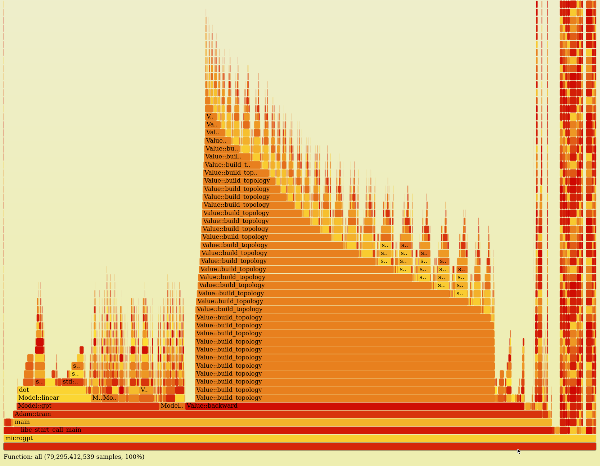

# microgpt-cpp

This project is a C++ recreation of karpathy's `microgpt.py`, in order to gain an intuition into the process of implementing forward and backward passes of a GPT-like language model, evaluate performance and perhaps most importantly, to have some fun.

Original Python implementation taken from [here](https://gist.github.com/karpathy/8627fe009c40f57531cb18360106ce95) (made by Andrej Karpathy).

For file downloads, the excellent and simple single-file header-only library [provided by yhirose](https://github.com/yhirose/cpp-httplib/) is used.

## Sample Output

```
Successfully saved "https://raw.githubusercontent.com/karpathy/makemore/refs/heads/master/names.txt" to "names.txt"
Initialized vocabulary of size 27
Initialized weights [layer0_attn_wk layer0_attn_wo layer0_attn_wq layer0_attn_wv layer0_mlp_fc1 layer0_mlp_fc2 lm_head wpe wte ] with normdist(mean=0, std_dev=0.08)
Created model(n_embed=16, n_head=4, n_layer=1, head_dim=4)
Training with num_steps=1000
step    0 / 1000 | Loss 3.39056
step    1 / 1000 | Loss 3.19808
step    2 / 1000 | Loss 3.30276
step    3 / 1000 | Loss 3.34283
...
step  997 / 1000 | Loss 1.46412
step  998 / 1000 | Loss 2.19503
step  999 / 1000 | Loss 1.45953
Inferring 30 samples with temperature 0.5
sample: aleya
sample: briona
sample: kela
sample: kaylen
sample: lailia
sample: alalee
sample: elelise
sample: jarllenn
sample: hoga
sample: anily
sample: elah
sample: taria
sample: maria
sample: amelera
sample: aliia
sample: cara
sample: jara
sample: kalia
sample: alila
sample: mallia
sample: adena
sample: rerla
sample: anale
sample: aleer
sample: mara
sample: alielee
sample: karile
sample: ya
sample: colya
sample: galina
```

## Performance comparison

Below is a simple performance comparison (AMD Ryzen 7 5700X).

command                | 200 training steps | 1k training steps
:----------------------|-------------------:|-----------------:
`python3 micrograd.py` |           0m3.421s |         1m13.109s
`make; micrograd`      |          0m15.446s |         0m17.132s

## Flamegraph Execution Time Breakdown

Flamegraphs generated as in `flamegraph.sh` can be used effectively to investigate detailed performance breakdowns.
Below is an example.

